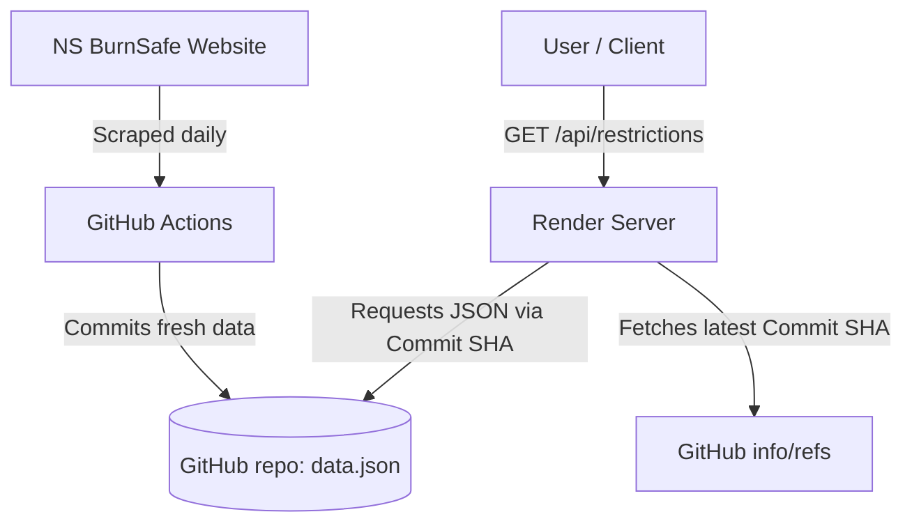

# Nova Scotia Burn Restrictions API (`nsburn-api`)

A lightweight API proxy and scraper that tracks daily open fires and burn restrictions for all counties in Nova Scotia.

The project scrapes data daily from the [Nova Scotia BurnSafe map](https://novascotia.ca/burnsafe/) and exposes it as a clean JSON endpoint deployed on **Render**.

> [!IMPORTANT]
> **Scraping Disclaimer**: This project is configured to query the official government website on a controlled, daily schedule via GitHub Actions. Please do not modify the code to run scraping processes on every API request. Over-scraping public government resources is unnecessary, wastes public bandwidth, and risks getting your server's IP address blacklisted. The existing workflow handles scraping requirements safely and efficiently.

---

## How It Works



1. **Daily Scrape**: A GitHub Action runs every day (from March 15 to October 15) at 2:15 PM Atlantic Time (17:15 UTC) to execute [scraper.js](scraper.js). This runs 15 minutes after the government updates the BurnSafe website (normally at 2:00 PM Atlantic) to allow for any delays on their end. It parses the Nova Scotia BurnSafe table and updates [data.json](data.json) in this repository.
2. **Dynamic Serving**: The API is hosted on Render ([server.js](server.js)). When someone calls the API, the server:
   - Resolves the latest commit SHA from GitHub.
   - Fetches the file contents dynamically using the unique commit SHA URL to bypass GitHub's aggressive 5-minute CDN caching.
3. **No Downtime/Overhead**: Render is configured to ignore `.github` and `data.json` paths so it doesn't rebuild the server on every daily update.

---

## API Endpoints

### `GET /`
Returns a responsive dashboard showing the operational state, the last scraped date/time, and basic information on how the API works, including a link to the GitHub repository.

### `GET /api/restrictions`
Fetches the current burn restrictions for all counties in Nova Scotia.

**Example Response:**
```json
{
  "dateTimeScraped": "2026-07-04T02:53:34.347Z",
  "data": [
    {
      "county": "Annapolis County",
      "color-status": "Yellow",
      "restriction-level": "Burning is only allowed between 7:00 pm and 8:00 am (burning is not allowed before 7:00 pm)"
    },
    ...
  ]
}
```

---

## Getting Started (Local Development)

### Prerequisites
Make sure you have [Node.js](https://nodejs.org/) installed.

### Setup
1. Clone the repository:
   ```bash
   git clone https://github.com/ShayneMcNeil/nsburn-api.git
   cd nsburn-api
   ```
2. Install dependencies:
   ```bash
   npm install
   ```

### Running the API Server
Start the local Express server:
```bash
node server.js
```
The server will be running on `http://localhost:3000`. You can test it by going to `http://localhost:3000/` in your browser.

---

## CLI Tool

A simple CLI utility ([cli.js](cli.js)) is included to display the current burn restrictions directly in your terminal in a clean table format.

### Run against the local server (default):
```bash
npm run cli
```

### Run against your deployed Render endpoint:
Pass your deployed API URL as an argument to the CLI:
```bash
node cli.js https://your-render-app.onrender.com/api/restrictions
```

---

## Testing

An integration test suite ([test.js](test.js)) is included to verify that the scraper and API endpoint function correctly.

### Run tests locally:
```bash
npm test
```
This command will start the local server in the background, fetch the restrictions endpoint, read the local `data.json`, and assert that the structure is valid.

### Run tests against your deployed Render endpoint:
You can pass a `RENDER_URL` environment variable to test the live deployed API:
* **PowerShell**:
  ```powershell
  $env:RENDER_URL="https://your-render-app.onrender.com"; npm test
  ```
* **Bash**:
  ```bash
  RENDER_URL="https://your-render-app.onrender.com" npm test
  ```

### CI/CD Workflow
The project runs a GitHub Actions workflow (`CI Test Suite` inside [.github/workflows/test.yml](.github/workflows/test.yml)) on every push to `main` (excluding data-only updates). This CI/CD suite automatically:
1. Waits for 1 minute to allow the Render server to finish deploying the new server code.
2. Triggers a new scrape run by invoking the `scrape.yml` workflow via GitHub CLI and watches it until it completes successfully.
3. Pulls down the newly committed `data.json` from the repository.
4. Executes the integration tests using the `RENDER_URL` secret/variable to call `/api/restrictions` on the deployed Render instance, asserting that the served API response matches the freshly committed `data.json` exactly.
