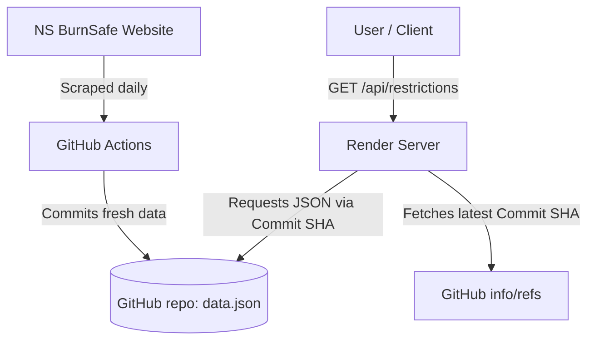

# Nova Scotia Burn Restrictions API (`nsburn-api`)

A lightweight API proxy and scraper that tracks daily open fires and burn restrictions for all counties in Nova Scotia.

The project scrapes data daily from the [Nova Scotia BurnSafe map](https://novascotia.ca/burnsafe/) and exposes it as a clean JSON endpoint deployed on **Render**.

---

## How It Works



1. **Daily Scrape**: A GitHub Action runs every day (from March 15 to October 15) to execute [scraper.js](scraper.js). It parses the Nova Scotia BurnSafe table and updates [data.json](data.json) in this repository.
2. **Dynamic Serving**: The API is hosted on Render ([server.js](server.js)). When someone calls the API, the server:
   - Resolves the latest commit SHA from GitHub.
   - Fetches the file contents dynamically using the unique commit SHA URL to bypass GitHub's aggressive 5-minute CDN caching.
3. **No Downtime/Overhead**: Render is configured to ignore `.github` and `data.json` paths so it doesn't rebuild the server on every daily update.

---

## API Endpoints

### `GET /api/restrictions`
Fetches the current burn restrictions for all counties in Nova Scotia.

**Example Response:**
```json
{
  "dateTimeScraped": "2026-07-04T02:53:34.347Z",
  "data": [
    {
      "county": "Annapolis County",
      "color-status": "Yellow",
      "restriction-level": "Burning is only allowed between 7:00 pm and 8:00 am (burning is not allowed before 7:00 pm)"
    },
    ...
  ]
}
```

---

## Getting Started (Local Development)

### Prerequisites
Make sure you have [Node.js](https://nodejs.org/) installed.

### Setup
1. Clone the repository:
   ```bash
   git clone https://github.com/ShayneMcNeil/nsburn-api.git
   cd nsburn-api
   ```
2. Install dependencies:
   ```bash
   npm install
   ```

### Running the API Server
Start the local Express server:
```bash
node server.js
```
The server will be running on `http://localhost:3000`. You can test it by going to `http://localhost:3000/api/restrictions` in your browser.

---

## CLI Tool

A simple CLI utility ([cli.js](cli.js)) is included to display the current burn restrictions directly in your terminal in a clean table format.

### Run against the local server (default):
```bash
npm run cli
```

### Run against your deployed Render endpoint:
Pass your deployed API URL as an argument to the CLI:
```bash
node cli.js https://your-render-app.onrender.com/api/restrictions
```
